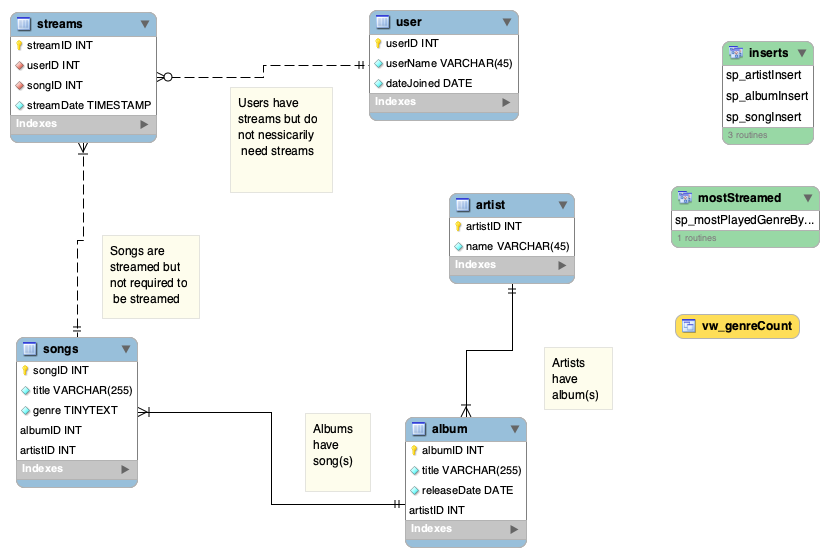
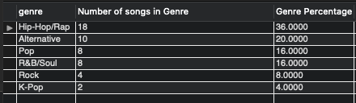
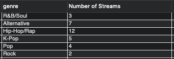
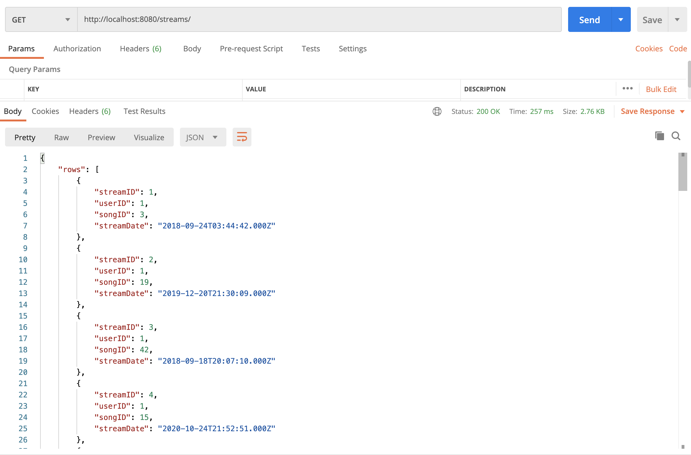
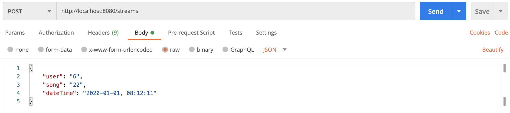
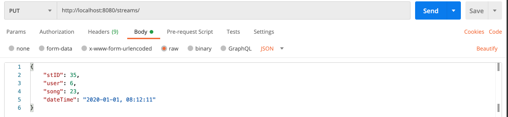
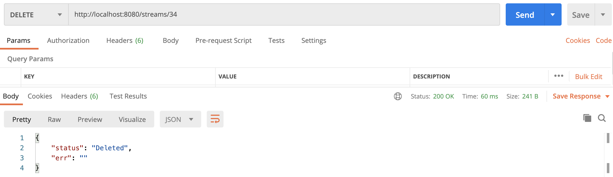

## Assignment 8 Learning Objectives
> Create a database model for anything that has some kind of business application of interest. Views and stored procedures are required along with a REST NodeJS server application.

### Part I
> Overview and business/use cases for the server application

- This model is to be used for a music streaming service like apple music or Spotify. In this database there are four main tables and a bridge table. The first four tables are `user` which contains user info. The next three tables are for music info: `artist`, `album`, and `songs`. The last table is a bridge table that correlates the user to what songs they have listen to and when it was streamed, this table is named `streams`.
- In a business realm this database can be used for both administrative services and marketing purposes. In an administrative application this database could be used to determine how many streams an artist has and based on streams determine how much to pay an artist. In a marketing sense this model could be used to give back data to the streaming service users. This can be done in a similar way that Spotify has done with their “wrapped” campaign. This is where at the end of each year Spotify shares user info to the subscriber and tells a story through data, like top genres listen to or artists, and what bands they discovered in the past 12 months.

### Part II

#### &nbsp;&nbsp;&nbsp;&nbsp;&nbsp;&nbsp; *Model:*

- My database is comprised of 5 tables, four data tables and a bridge table(M:N) for `streams`. To see the elements and relationships in  database see my model below.

#### &nbsp;&nbsp;&nbsp;&nbsp;&nbsp;&nbsp; *Tables:*

- The tables related to music itself consists of `10 artists`, `25 albums`, and `50 songs`
- This model consists of `6 users` and a combined total of `33 streams` in all

#### &nbsp;&nbsp;&nbsp;&nbsp;&nbsp;&nbsp; *View:*

- The view I created for this model shows the different types of genres found, the number of songs in that genre and the percent of the total number of songs that genre consists of.

- For the code used to build this view click [Here](Code/vw_genreCount.sql) for the MySQL file.

#### &nbsp;&nbsp;&nbsp;&nbsp;&nbsp;&nbsp; *Stored procedure:*

- I first created 3 stored procedures to simply complete insert functions one for each of the following tables: `artist`, `album`, and `songs`
  - for the create statement code click [Here](Code/storedInserts.sql) to view the MySQL file.
- The fourth stored procedure outputs the number of streams for each genre listened to based on which `user ID` is inputed. 
  - the image below show an example for the user with ID 1

  - for the create statement code click [Here](Code/mostPlayed.sql) to view the MySQL file.

### Part III
>NodeJS & REST app

- In this section I had to create a sever application that implemented, GET, POST, PUT, and DELETE routes for a RESTful API through Postman.

#### &nbsp;&nbsp;&nbsp;&nbsp;&nbsp;&nbsp; *GET:*
- There are two GETs for this API, one for `songs` and another for `streams`. Here is a sample of what Postman returns:
 
  - for a complete get request of `songs` click [Here](Text/songs.txt) and [Here](Text/streams.txt) for `streams`

#### &nbsp;&nbsp;&nbsp;&nbsp;&nbsp;&nbsp; *POST, PUT, & DELETE:*
- I created one **POST**, **PUT**, **DELETE** and for `streams` in this API
  - The **POST** creates a new entry for the `streams` table

  - The **PUT** updates an existing entry in the `streams` table

  - The **DELETE** gets rid of a stream by its ID in the `streams` table

>> for the full server code click [Here](cit381-assign08-server.js) to view the javascript

>> Back to home page:
[Home](https://rweston233.github.io/)
